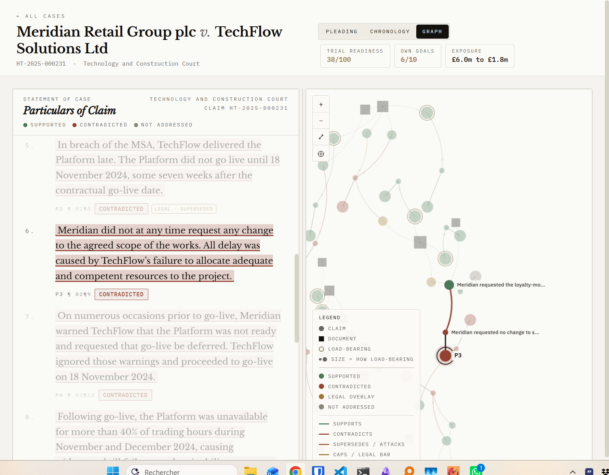
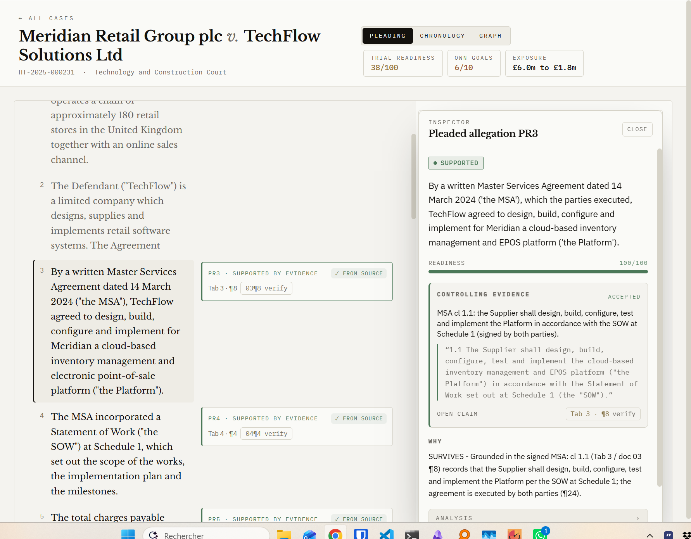
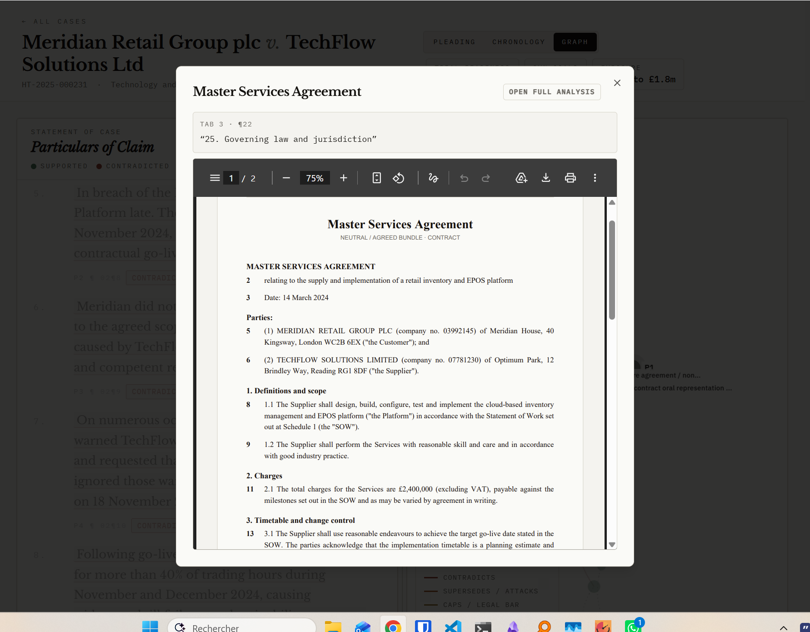
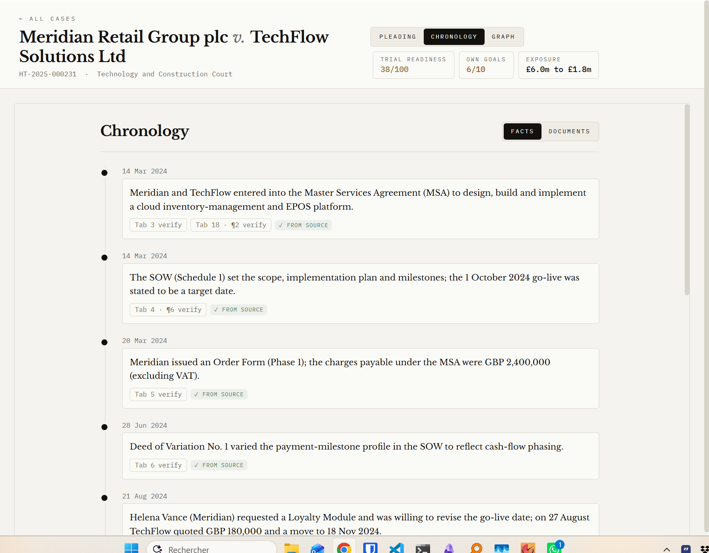

<div align="center">

# PleadProof

### Does your own evidence actually back the case you pleaded?

## [Try it live: pleadproof.lovable.app](https://pleadproof.lovable.app)

[](https://pleadproof.lovable.app)
&nbsp;
[](https://react.dev)
[](https://vitejs.dev)
[](https://neo4j.com)
[](https://cloud.google.com/vertex-ai)
[](https://op.europa.eu/en/web/cellar)
[](https://www.python.org)

**Team Behemoth: Benjamin Lapostolle, Daryl Lee, Ruben Dahan.** Built for the CMS x Harvey Pleading-to-Proof challenge, Hack the Law 2026.

<br />



*The evidence graph. Every pleaded allegation is traced to the documents for and against it, with the own-goals highlighted.*

</div>

## The problem

In complex litigation, a team has to move from a large body of documents to a clear case theory. A pleading carries dozens of allegations that each have to be proved, but the evidence that proves or breaks them is scattered across witness statements, correspondence, expert materials, contracts and internal records. Reviewing all of it by hand is slow, and a team can discover late, sometimes far too late, that a key allegation is not properly evidenced, or that contrary evidence sitting in its own bundle was never accounted for.

## What it does

PleadProof takes a litigation bundle and a pleading and stress-tests the case theory. It maps every pleaded allegation to the evidence and labels it supported, contradicted, or unaddressed. It highlights the gaps, the contradictions, and the own-goals (a document in your own bundle that defeats your pleaded case), and presents a trial-readiness view of where the case actually stands. Every verdict is linked to a verbatim quote from the source, so any conclusion can be checked against the real text in one click.

## How it works

One pipeline, end to end:

1. Ingest the bundle and the pleading.
2. Extract the pleaded points.
3. Build a claim-and-evidence graph in Neo4j, where every allegation and every piece of evidence is a node and the relationships between them are edges.
4. Embed and retrieve with Google Vertex AI, so the one clause that decides a point surfaces instead of being buried.
5. An LLM assesses each point against its retrieved evidence.
6. We add contradiction detection (the own-goal label) and verbatim source-grounding on top.
7. The front end renders the result: the annotated pleading, the evidence graph, the chronology, and an in-site source reader.

## Screenshots



*The annotated pleading with the Inspector. Each paragraph gets a verdict, a readiness score, and the controlling evidence with a verbatim quote.*



*The in-site source reader. Open any cited document at the exact paragraph, with the real PDF.*



*The chronology. The dated spine of the case, every fact linked to its source.*

## The cases

- **Meridian** is the official CMS bundle, 21 documents. A commercial dispute over a delayed software platform.
- **Brightmarket** is a harder GDPR stress-test we built ourselves, with deliberately planted traps (a clause that reads like a warranty until the next line, a figure that looks consistent until you check the unit, an impossible chronology, a multi-document inference that breaks, a superseded draft clause, a genuinely ambiguous claim, and a duty that sits with the other party).

## Results

13/13 against our human-verified gold set on the curated Meridian demo.

## Tools

Each tool does one clear job:

- **Lovable** is where PleadProof is built and deployed. The whole front end, the annotated pleading, the evidence graph, the chronology, and the in-site source reader, is built on Lovable, and the live app runs at pleadproof.lovable.app.
- **Neo4j** stores the case as a graph. Every pleaded allegation and every piece of evidence is a node, and the relationships between them (supports, contradicts, supersedes, caps) are edges. The analysis is graph-native, which is what lets the front draw the evidence map.
- **Google Vertex AI** provides the embeddings. We embed every document of the bundle and every pleaded point, retrieve the most relevant documents per point, and cross-examine them — so the evidence for and against a point is read in full, not truncated to a snippet.
- **NVIDIA Nemotron** is a first-class, drop-in option for the LLM. It sits behind a single seam that speaks the OpenAI protocol, so pointing the pipeline at a local or hosted Nemotron is a one line environment change (set the base URL and the model name), letting the whole analysis run on open weights on a firm's own hardware. (Our reference runs used a hosted GPT-class model through the same seam.)
- **EU Publications Office (Cellar API)** supplies the authentic legal references in the second case. The Brightmarket GDPR dispute is a scenario we wrote ourselves, but its legal grounding is real: the regulations and directives it cites (the GDPR and related instruments) are pulled by their CELEX identifiers from the Cellar API, so the law in the case is authentic rather than invented.

## Repository layout

```
pleadproof/
├── src/                      React 19 front end (TanStack Start, Vite)
│   ├── components/           annotated pleading, evidence graph, source reader, chronology
│   ├── routes/               pages and routing
│   ├── lib/                  shared types, case data, helpers
│   └── integrations/         Supabase client
├── public/                   static assets (favicon, source documents)
├── backend/
│   ├── pipeline/             the graph pipeline (claims, evidence graph, embeddings, scoring)
│   │   ├── prompts/          LLM prompt templates
│   │   └── configs/          run configuration (Vertex, Neo4j, model)
│   ├── mapper.py             pipeline run to front-end AppData, with verbatim grounding
│   ├── grounding.py          paragraph splitting and verbatim quoting helpers
│   ├── contradiction.py      the CONTRADICTED (own-goal) verdict
│   ├── requirements.txt
│   └── cases/
│       ├── cms_synthetic/    Meridian, the official CMS bundle
│       └── eu_brightmarket/  Brightmarket, our GDPR stress-test
└── docs/
    └── screenshots/          the images in this README
```

## Running it

### Front end

```bash
npm install
npm run dev
```

### Backend

```bash
cd backend
pip install -r requirements.txt

# Run the pipeline on a case: phase 0 builds the graph, phase 1 the edges, phase 2 scores each point.
python -m pipeline.cli phase0 --case cases/cms_synthetic --out runs/cms_p0 \
    --config pipeline/configs/default.yaml --prompts pipeline/prompts
python -m pipeline.cli phase1 --phase0 runs/cms_p0 --out runs/cms_p1 \
    --config pipeline/configs/default.yaml --prompts pipeline/prompts
python -m pipeline.cli phase2 --phase1 runs/cms_p1 --out runs/cms_p2 \
    --config pipeline/configs/default.yaml --prompts pipeline/prompts

# Map the run into the AppData JSON the front renders.
python mapper.py --run runs/cms_p2 --case cases/cms_synthetic --out appdata.json
```

Environment:

- **Neo4j**: set `NEO4J_URI`, `NEO4J_USER`, `NEO4J_PASSWORD` to persist the evidence graph.
- **Google Vertex AI**: set `GOOGLE_CLOUD_PROJECT` (and your Google credentials) for the embeddings.
- **Nemotron (one line swap)**: keep the OpenAI-protocol provider and point `OPENAI_BASE_URL` at your local or hosted Nemotron server, then set the model name. No code change, it runs on open weights.

## Credits

Team Behemoth: Benjamin Lapostolle, Daryl Lee, Ruben Dahan.
